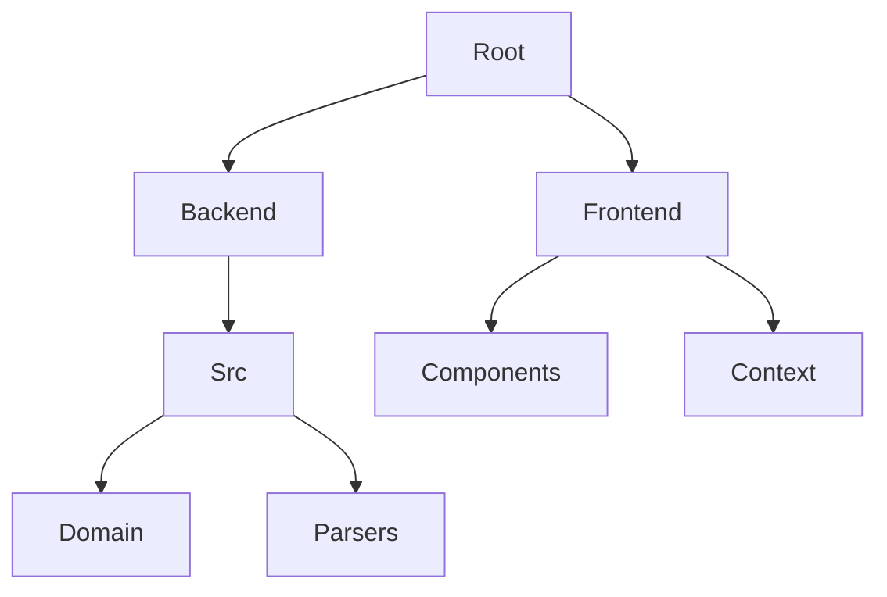

# 📄 PDF Parser Project (PPP)


<!-- Replace the above URL with the actual banner once generated -->

**A modern, robust web application for extracting text and insights from PDF documents using multiple advanced parsing strategies.**

---

## 🌟 Overview

**PPP** is designed to provide developers and users with a flexible interface to parse PDF documents. By leveraging a **Hexagonal Architecture**, the system decouples the core parsing logic from the external interfaces, allowing for easy addition of new parsers and distinct front-end experiences.

### 🎯 Key Features

-   **🧩 Multi-Strategy Parsing:** Choose the best tool for the job.
    -   `Docling`: Advanced document structure analysis.
    -   `PyMuPDF`: Fast, high-fidelity text extraction.
    -   `PDFMiner`: Detailed layout and location data.
    -   `PyPDF2`: Lightweight metadata and basic text.


---

## 🚀 Quick Start

The fastest way to get running is via Docker.

### Prerequisites

-   Docker & Docker Compose

### Run the App

```bash
docker-compose up --build
```

Access the application:
-   **Frontend:** [http://localhost:5173](http://localhost:5173)
-   **Backend API Docs:** [http://localhost:8000/docs](http://localhost:8000/docs)

---

## 👩‍💻 Developer Guide

For detailed setup instructions for specific components, please refer to their respective READMEs:

-   [**Backend Documentation**](./backend/README.md) - Setup, testing, and API details.
-   [**Frontend Documentation**](./frontend/README.md) - Components, state management, and styling.

### Project Structure



---

## 📜 License

This project is licensed under the MIT License.