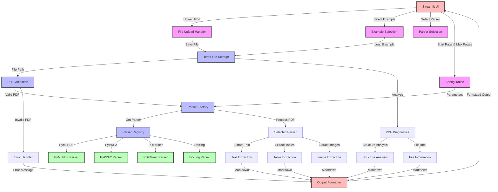

```mermaid
graph TD
    %% User Interface Layer
    UI[Streamlit UI] --> |Upload PDF| FileUpload[File Upload Handler]
    UI --> |Select Example| ExampleSelect[Example Selection]
    UI --> |Select Parser| ParserSelect[Parser Selection]
    UI --> |Start Page & Max Pages| Config[Configuration]

    %% File Processing Layer
    FileUpload --> |Save File| TempFile[Temp File Storage]
    ExampleSelect --> |Load Example| TempFile
    TempFile --> |File Path| PDFValidation[PDF Validation]
    PDFValidation --> |Valid PDF| ParserFactory[Parser Factory]
    PDFValidation --> |Invalid PDF| ErrorHandler[Error Handler]

    %% Parser Layer
    ParserFactory --> |Get Parser| ParserRegistry[Parser Registry]
    ParserRegistry --> |PyMuPDF| PyMuPDF[PyMuPDF Parser]
    ParserRegistry --> |PyPDF2| PyPDF2[PyPDF2 Parser]
    ParserRegistry --> |PDFMiner| PDFMiner[PDFMiner Parser]
    ParserRegistry --> |Docling| Docling[Docling Parser]

    %% Processing Flow
    Config --> |Parameters| ParserFactory
    ParserFactory --> |Process PDF| SelectedParser[Selected Parser]
    SelectedParser --> |Extract Text| TextExtraction[Text Extraction]
    SelectedParser --> |Extract Tables| TableExtraction[Table Extraction]
    SelectedParser --> |Extract Images| ImageExtraction[Image Extraction]

    %% Diagnostic Layer
    TempFile --> |Analyze| PDFDiagnostics[PDF Diagnostics]
    PDFDiagnostics --> |Structure Analysis| StructureAnalysis[Structure Analysis]
    PDFDiagnostics --> |File Info| FileInfo[File Information]

    %% Output Layer
    TextExtraction --> |Markdown| OutputFormatter[Output Formatter]
    TableExtraction --> |Markdown| OutputFormatter
    ImageExtraction --> |Markdown| OutputFormatter
    StructureAnalysis --> |Markdown| OutputFormatter
    FileInfo --> |Markdown| OutputFormatter
    ErrorHandler --> |Error Message| OutputFormatter

    %% Final Output
    OutputFormatter --> |Formatted Output| UI

    %% Styling
    classDef ui fill:#f9f,stroke:#333,stroke-width:2px
    classDef process fill:#bbf,stroke:#333,stroke-width:2px
    classDef parser fill:#bfb,stroke:#333,stroke-width:2px
    classDef output fill:#fbb,stroke:#333,stroke-width:2px

    class UI,FileUpload,ExampleSelect,ParserSelect,Config ui
    class TempFile,PDFValidation,ParserFactory,ParserRegistry process
    class PyMuPDF,PyPDF2,PDFMiner,Docling parser
    class OutputFormatter,UI output
```